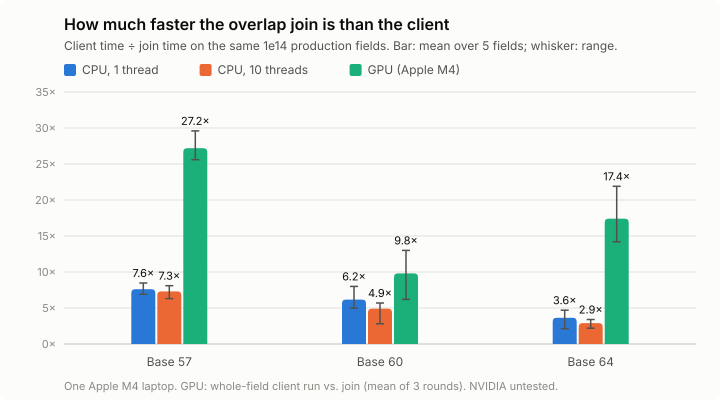

# The overlap join: a faster niceonly search for the public client

A proposal for [wasabipesto/nice](https://github.com/wasabipesto/nice): a different way to organise the niceonly search inside a field. It keeps exactly the client's soundness guarantee, and it is faster than the client's own code on the same production fields. CPU and GPU versions are both here, with every measurement made head to head against the client at commit [`fe1b0b8`](https://github.com/wasabipesto/nice/tree/fe1b0b8).



| Base | CPU, 1 thread | CPU, 10 threads | GPU (Apple M4, the client's CubeCL path) |
|---:|---:|---:|---:|
| 57 | **7.6×** (6.9–8.5) | **7.3×** (6.3–8.1) | **27.2×** (25.6–29.6) |
| 60 | **6.2×** (5.0–8.0) | **4.9×** (2.8–5.7) | **9.8×** (6.2–13.0) |
| 64 | **3.6×** (2.1–4.7) | **2.9×** (2.2–3.4) | **17.4×** (14.2–21.9) |

**How the numbers were made:**
- Each cell is client time ÷ join time on the same 1e14 production fields: the mean over 5 fields, with the range in brackets.
- The client runs as its own code. On CPU that is `process_range_niceonly`; on GPU it is `begin`/`finish_niceonly_cubecl` with fleet defaults, one whole-field run per field.
- On GPU the join's top certification ran on the host. With it on the device, the GPU ratios are 30.5×, 10.9× and 18.0×.
- **Everything was measured on one Apple M4 laptop. Nothing has run on NVIDIA**; see [what transfers](#what-transfers-to-nvidia).

## Contents

- [The idea](#the-idea)
- [Why it is sound](#why-it-is-sound)
- [How it differs from the current pipeline](#how-it-differs-from-the-current-pipeline)
- [Evidence: correctness](#evidence-correctness)
- [Evidence: CPU](#evidence-cpu)
- [Evidence: GPU](#evidence-gpu)
- [What transfers to NVIDIA](#what-transfers-to-nvidia)
- [Integration proposal](#integration-proposal)
- [Limitations](#limitations)
- [Reproducing](#reproducing)
- [Files](#files)
- [Credits and disclosure](#credits-and-disclosure)

## The idea

For a candidate n with L base-b digits:

- **The top t digits of n** fix the top digits of n² and n³ across the whole interval they define. The client already uses this in its MSD filter.
- **The bottom k digits of n** fix the bottom k digits of n² and n³ exactly. The client uses this with k = 3 in its stride table.

The client's pipeline keeps the two ends mostly separate: MSD ranges of about 10⁴ numbers, then a walk over every stride candidate inside each surviving range, with a cross-end AND between the range's top digits and the candidate's 6 low digits.

The overlap join makes the two ends **deep enough to overlap**: t + k > L, so the two lists share o = t + k − L digits of n.

```
digits of n:   [ top t digits .................... ]
                              [ ........ bottom k digits ]
                              |<- o shared ->|
```

- **Top list.** Every t-digit prefix P whose certified top digits of n² and n³ are distinct.
- **Bottom list.** Every residue R = n mod b^k whose k lowest digits of n² and n³ are distinct.
- **Join.** Every n in the field is exactly one pair (P, R) that agrees on the o shared digits. Hash the bottom list on the shared digits and look each prefix up, instead of iterating through candidates.
  - The digit-sum class mod b−1 goes into the hash key, so only classes that satisfy n² + n³ ≡ b(b−1)/2 (mod b−1) are ever matched.
  - Each matched pair costs **one 64-bit AND** of the two certified-digit masks. They cover disjoint output positions: the top side is capped at positions ≥ k.
  - Pairs that pass are fully checked with the client's own check: `get_is_nice` on CPU, `candidate_check` on GPU.
- **Partitioning.** The lowest p shared digits split the work into b^p independent partitions. Each partition needs about 50 MB, and partitions are the natural unit for threads or GPU batches.

Each shared digit of n certifies four output digits (two from the top, two from the bottom) instead of two. At base 57 with (t, k, p) = (9, 6, 2), each surviving pair has about 16 certified top digits and 12 certified bottom digits. The client's stride candidates have about 16 and 6.

## Why it is sound

A nice n uses every digit exactly once, so its digits are distinct on **every subset** of output positions. Therefore:

1. its t-digit prefix passes the top check, because those certified digits are distinct;
2. its residue mod b^k passes the bottom check, for the same reason;
3. its digit-sum class is a valid root, so it is in the hash key;
4. its (P, R) pair agrees on the shared digits, so it is matched;
5. the AND of the two masks is zero, because the positions are disjoint and the digits are distinct;
6. so it reaches the full check and is reported.

Every n in the field corresponds to exactly one (P, R) pair, so nothing is double-counted and nothing is skipped. This is the same argument that makes the client's own MSD, LSD and cross-end filters sound; the join only changes how the two sides are enumerated and matched.

The GPU version adds one more filter before the full check: the low k+2 digits of n² and n³, computed from n's low k+2 digits, must be distinct. That is sound for the same reason.

## How it differs from the current pipeline

Measured at base 57, per production field, with the client's CPU settings (stride k = 3, minimum MSD range 8,000):

| | Client (v3.4.5+) | Overlap join, (9, 6, 2) |
|---|---|---|
| Top side | MSD recursion with Hall's condition; ranges of about 10⁴ numbers certify about 16 top digits | t-digit prefixes certify about 16 top digits |
| Bottom side | 3 digits of n certify 6 low digits | 6 digits of n certify 12 low digits |
| How the two sides meet | Walk every stride candidate in each surviving range; cross-end AND rejects 88% | Hash join on the shared digits and the digit-sum class; one AND per pair |
| O(1) steps | 8.3×10¹¹ stride visits | 4.9×10¹¹ pair ANDs |
| Full checks | 1.0×10¹¹ | 7.2×10⁹ (**about 14× fewer**; about 330× fewer on GPU with the prefilter) |
| Expensive per-range work | About 1.3×10⁸ MSD analyses (≈ µs each) | 2.4×10⁸ top-prefix certifications and 1.5×10¹⁰ bottom-list steps |

The wall-time gain comes mostly from removing expensive operations: full checks with 256-bit arithmetic, and MSD analyses. The number of cheap O(1) steps falls by less than 2×.

## Evidence: correctness

1. **CPU exactness windows.** The CPU prototype's survivor sets and match counts equal a brute-force evaluation of the same certificates, n by n, on 21 windows across bases 20–64.
   - The windows are aligned and unaligned, use several (t, k, p), and include six where the client's MSD filter lets candidates through.
   - Base 10 returns 69.
   - Rerun on 2026-09-29 with this folder's build: **ALL EXACT** ([`evidence/verify.json`](evidence/verify.json)).
2. **GPU exactness** ([`gpu/README.md` §3](gpu/README.md#3-correctness-final-build-nothing-hidden)):
   - The same 21 windows, with tops certified on the host and with tops on the device: GPU survivors = CPU = brute force, **21/21**. This was rerun on the build pinned to the git rev.
   - **120 real production partitions** across 15 fields at bases 57, 60 and 64: exact. That is 1.5×10⁸ survivors and 1.1×10¹⁰ matches, identical to the CPU prototype.
3. **One GPU bug was found by re-verification and fixed.** Padding slots could let extra candidates through when a top had an all-zero certificate.
   - It was superset-only: it could add survivors, never drop a nice number.
   - It never occurs at production settings.
   - Every suite was rerun on the fixed build, and all numbers here come from it.
4. **Every known solution is recovered.** A C version of the join ran over the complete intervals of every base where the full answer is known, with the client's filtering rules generalised to "every digit exactly K times" ([`evidence/testbed_join.json`](evidence/testbed_join.json)):
   - nice numbers, bases 25–40: none exist, and none were reported;
   - twice-nice, bases 15–22: all 21 known solutions recovered;
   - thrice-nice: 16/16 in base 13 and 38/38 in base 14.

## Evidence: CPU

**Operation counts against a faithful model of the client.** The client's niceonly CPU pipeline was re-implemented with operation counters. On sample windows at bases 25–64 it matches the unmodified `nice_common` exactly on leaves, visits, cross-end rejects, full checks and hits ([`evidence/client_reimpl_crosscheck.json`](evidence/client_reimpl_crosscheck.json)). On the exact test bases ([`evidence/testbed_summary.md`](evidence/testbed_summary.md)):

| Case | Client ops ÷ join ops | Client full checks ÷ join full checks |
|---|---:|---:|
| Nice, bases 25–34 | 0.7–3.1× | 7–115× |
| Nice, bases 37–40 | 3.0–4.1× | 87–311× |
| Twice-nice, bases 15–22 | 0.9–2.2× | 5–63× |
| Thrice-nice, bases 13–14 | 0.7× | 7–12× |

The gain grows with the base. At the smallest bases the client is as good or better.

**Head-to-head wall time on production fields** ([`evidence/cpu_bench_pair.jsonl`](evidence/cpu_bench_pair.jsonl)):
- Five real 1e14 fields per base were taken from the public API.
- **Client:** its own `process_range_niceonly` (stride k = 3, minimum range 8,000) on 120 random 1e9 chunks of each field.
- **Join:** the top layer once, plus 36 random partitions.
- One thread each, interleaved over three rounds so that machine load hits both alike.

| Base | (t, k, p) | Join s per field (mean) | Client s per field (mean) | Client ÷ join, mean of per-field ratios (range) |
|---:|---|---:|---:|---|
| 57 | (9, 6, 2) | 1,951 | 14,914 | **7.6×** (6.9–8.5) |
| 60 | (9, 6, 2) | 831 | 5,142 | **6.2×** (5.0–8.0) |
| 64 | (10, 6, 2) | 1,531 | 5,792 | **3.6×** (2.1–4.7) |

Additional CPU measurements:
- **The client's release profile.** Built with `lto = true` and `codegen-units = 1`, the ratios are unchanged ([`evidence/cpu_bench_pair_lto.jsonl`](evidence/cpu_bench_pair_lto.jsonl)).
- **10 threads.** On the same fields, both run on 10 threads: client chunks across threads, join partitions across threads ([`gpu/results/cpu_context.jsonl`](gpu/results/cpu_context.jsonl)). The join is 7.3×, 4.9× and 2.9× faster.
- **A model for bases 57–64.** It uses exact client sampling and Monte Carlo join rates ([`evidence/model_gain.json`](evidence/model_gain.json)). It gives a 2–3× reduction in operations per field. Larger fields help, because the bottom lists are a fixed cost per field: at base 57, 1e16 fields give about 5×.

## Evidence: GPU

Full report: [`gpu/README.md`](gpu/README.md). Code: [`gpu/src/`](gpu/src/).

**The implementation** is in CubeCL 0.10, following `cubecl_backend.rs` conventions: comptime divisors, u32 buffers, cube-scoped compaction, and the client's `flush` and `launch_fence` handling. One kernel source therefore targets Metal and Vulkan (wgpu) and CUDA (cubecl-cuda). Per 1e14 field, after a 20 ms host setup, all b^p partitions run in batches of 4:
1. **Tops:** certified on host threads, or on the device with `JOIN_DEVTOPS=1`.
2. **Bottoms:** extended and bucketed on the device.
3. **Join:** one cube per bucket. Tops sit in threadgroup memory and 4 bottom entries in registers per thread; a branch-free AND covers 32 tops at a time.
4. **Prefilter:** low-digit distinctness, keeping about 6%.
5. **Full check:** the client's own `candidate_check`.

Device memory is about 0.5 GB.

**Results on the same Apple M4 GPU, per 1e14 production field.** No sampling on either side: one whole-field client run, and whole-field join runs averaged over 3 interleaved rounds.

| Base | Client (fleet defaults) | Join, host tops | Join, device tops | Client ÷ join, host tops (range) | Device tops | Against the client's best pinned floor (host / device tops) |
|---:|---:|---:|---:|---|---|---|
| 57 | 420 s | 15.4 s | 13.7 s | **27.2×** (25.6–29.6) | **30.5×** | 25.3× / 28.4× |
| 60 | 89 s | 8.9 s | 8.1 s | **9.8×** (6.2–13.0) | **10.9×** | 10.3× / 11.4× |
| 64 | 249 s | 14.0 s | 13.5 s | **17.4×** (14.2–21.9) | **18.0×** | 15.8× / 16.3× |

**Checks that the client baseline is fair:**
- The client's own device tests pass on this GPU, and it finds 69 in base 10.
- The maintainer's own `pipeline_throughput_fixed_fields` harness runs within 17–18% of the maintainer's recorded M4 figures. This copy was slightly slower, which could overstate the ratios by up to about 1.2× if the slowdown is specific to the client.
- The direct-MSL Metal build is no faster than WGSL, for either side.
- The fleet's MSD-floor clamp costs the client up to 17% on this GPU. That is why ratios against its best pinned floor are also given.
- A 10% stratified sample of the client turned out 10–24% biased high, because of per-piece start-up overhead. That is why the headline uses whole-field client runs.

**Where the gain comes from** (base 57):
- **Fewer operations:** 2.4× fewer O(1) tests, and about 330× fewer full checks after the prefilter.
- **Cheaper operations:** each test is about 55–68× cheaper on this GPU. The join's is a register-tiled AND at about 4 ps. The client's stride visit, about 0.25 ns, does a candidate rebuild, a random 8-byte gather from a 6.4 MB table, and cube-scoped compaction.
- **The GPU magnifies the CPU gain.** Going from 10 CPU cores to the M4 GPU, the client speeds up 3–7× and the join 14–18×.
- **Host cores:** with tops certified on the host, the join keeps 3–8 host cores busy. With device tops it needs about 0.1 core.

## What transfers to NVIDIA

Nothing here ran on NVIDIA.
- **Transfers:** the operation counts (ANDs, survivors, full checks), the exactness evidence, and the structure (a dense tile against a gather-and-compact walk), because the CubeCL source is the same for every runtime.
- **Least likely to transfer:** the 55–68× per-test cost ratio. The client's 6.4 MB gather fits in NVIDIA's much larger L2 (40 MB on A100, 72 MB on RTX 4090), and CUDA's wide digit scan makes the client's many full checks cheaper.
- **Bounds.** If full checks were free, the base-57 ratio would fall from about 27× to about 20×. If the client's visit also became 3× cheaper relative to an AND, roughly 7–10× would remain. Those are illustrations, not measurements.
- **Big GPUs need device tops.** On a device about 10× faster than this M4, host-side tops would need about 60 host cores.
- **CUDA design.** [`gpu/CUDA_NOTE.txt`](gpu/CUDA_NOTE.txt) maps the kernels onto `nice_kernels.cu`, untested. `--features cubecl-cuda` should run the CubeCL version unchanged, also untested.

**The first thing to measure on NVIDIA** is the client's stride-visit cost against the join's AND cost.

## Integration proposal

1. **Interface.** Keep the client's contract, a field [s, e) in and nice numbers out. The join changes only what happens inside the niceonly path: a sibling of `process_range_niceonly` on CPU, and of `begin_niceonly_cubecl` on GPU.
2. **Parameters.** Pick (t, k, p) per base from a small table. The measured settings are (9, 6, 2) at bases 57 and 60 and (10, 6, 2) at base 64. They were tuned for CPU wall time; GPU-specific tuning has not been done.
3. **Work split.** The top layer is built once per field, and the b^p partitions are independent. On GPU the work unit becomes (field, partition value) instead of (offset, len, mask) ranges.
4. **GPU default.** Device-side tops. They need almost no host CPU and are as fast or faster end to end.
5. **Safety net.** Ship it behind a flag. Before switching any default, require the exactness suites (21 windows plus production partitions) and the known-solution testbed. The client has had filter soundness bugs before (CHANGELOG v3.2.15, v3.3.0), and this work found one in its own GPU kernel the same way.
6. **Server side (optional).** Larger fields help the join. If the server can hand out 1e15–1e16 fields at the frontier, the gain grows.

## Limitations

- **One machine.** Everything ran on an Apple M4 laptop, 10 CPU cores and a 10-core GPU, with other work running. Interleaved rounds control for drift.
- **No NVIDIA measurements**, and no device timestamps on Metal. "Device only" times are wall time with host work precomputed.
- **CPU sampling.** The 1-thread CPU figures sample 120 client chunks and 36 join partitions per field (about ±10–20% per field). The headline GPU figures are not sampled.
- **Small bases.** Below about base 35, and for the thrice-nice analogue, the client is as fast or faster. The join is for the frontier.
- **Prior art.** The join itself is not new. Geißer, Körner, Kurz and Zahn used prefix and suffix lists hash-joined on shared digits for squares with three distinct digits ([arXiv:2112.00444](https://arxiv.org/abs/2112.00444), §6). What is new here is applying it to this search, adding the GPU kernel, and measuring both against this client.
- **What it buys.** It makes the search cheaper; it does not change what the search can prove. At bases 57–60, cost per expected nice number grows about 3× per base, so a 10–27× gain is worth roughly two to three bases.

## Reproducing

**CPU prototype** ([`cpu/`](cpu/), Rust; pulls `nice_common` from GitHub at `fe1b0b8`):

```sh
cd overlap-join/cpu && cargo build --release
B=target/release/join_proto
$B full 10 47 100 2 1 0                                   # base 10: hits [69]
$B verify 57 78920310198429586458 78920310198429886458 10 4 1   # join vs brute force on a window
$B field 57 <FIELD_START> <FIELD_START+1e14> 9 6 2 12 1   # per-field cost from 12 random partitions
$B client 57 <FIELD_START> <FIELD_START+1e14> 1000000000 40 1   # the client's own process_range_niceonly
JOIN_PROTO=$PWD/$B python3 ../evidence/verify.py          # the 21-window exactness suite
```

**GPU** ([`gpu/`](gpu/); on a Mac this runs on Metal):

```sh
cd overlap-join/gpu && cargo build --release        # --features cubecl-cuda for NVIDIA (untested)
B=target/release/overlap_join_gpu
$B verify 10 47 100 2 1 0                           # base 10 -> 69, GPU = CPU = brute force
JOIN_GPU=$PWD/$B python3 scripts/verify_gpu.py      # 21 windows
$B field-full 57 <FIELD_START> <FIELD_START+1e14> 9 6 2 9 4       # one whole field, join
$B client-range 57 <FIELD_START> <FIELD_START+1e14>               # one whole field, the client's own CubeCL path
```

Field starts come from the public API, e.g. `https://data.nicenumbers.net/fields?base_id=eq.57`; the 15 benchmark fields are listed in [`gpu/README.md` §4.2](gpu/README.md#42-per-field-seconds-per-1e14-field). The original CPU benchmark driver, the client re-implementation (`client_count.c`) and the model are in [`attack/d5-client-join/`](../attack/d5-client-join/).

## Files

| Path | Contents |
|---|---|
| `cpu/` | Rust CPU prototype (`lib.rs`: the join; `main.rs`: the `verify`, `full`, `field` and `client` modes) |
| `gpu/` | CubeCL GPU implementation, its scripts, results and full report ([`gpu/README.md`](gpu/README.md)); the CUDA design note (`CUDA_NOTE.txt`) |
| `evidence/speedup.svg`, `speedup.png`, `make_chart.py` | The chart above (SVG with dark mode; PNG for embedding elsewhere) and the script that draws it |
| `evidence/verify.py`, `verify.json` | 21-window CPU exactness suite and its latest result |
| `evidence/testbed_*.json`, `testbed_summary.md` | Operation counts on the exact testbed, client against join |
| `evidence/client_reimpl_crosscheck.json` | The client re-implementation against the unmodified `nice_common` |
| `evidence/cpu_bench_pair*.jsonl` | Head-to-head single-thread CPU timings on production fields |
| `evidence/model_gain.json` | Modelled gain at bases 57–64 |
| `ISSUE.md` | Draft of the upstream issue |

## Credits and disclosure

This work was produced largely by AI agents (Anthropic's Claude), directed by the repository owner, as part of the research in this repository. Every correctness claim above rests on exact checks against the client's own code, which anyone can rerun. `gpu/src/client_check.rs` is a verbatim copy of the client's `candidate_check`, used under its MIT licence (© 2024 wasabipesto).

Sources:
- [wasabipesto/nice](https://github.com/wasabipesto/nice) at `fe1b0b8`: `common/src/msd_prefix_filter.rs`, `lsd_filter.rs`, `stride_filter.rs`, `residue_filter.rs`, `client_process.rs`, `gpu_niceonly.rs`, `cubecl_backend.rs`, `cuda/nice_kernels.cu`, and the [CHANGELOG](https://github.com/wasabipesto/nice/blob/fe1b0b8/CHANGELOG.md).
- M. Geißer, T. Körner, S. Kurz, A. Zahn, squares with three distinct digits: [arXiv:2112.00444](https://arxiv.org/abs/2112.00444).
- N. Möller, T. Granlund, "Improved division by invariant integers", *IEEE Transactions on Computers* 60(2), 2011: [doi:10.1109/TC.2010.143](https://doi.org/10.1109/TC.2010.143).
- NVIDIA L2 sizes: [A100 whitepaper](https://images.nvidia.com/aem-dam/en-zz/Solutions/data-center/nvidia-ampere-architecture-whitepaper.pdf) (40 MB); [Chips and Cheese, RTX 4090](https://chipsandcheese.com/p/microbenchmarking-nvidias-rtx-4090) (72 MB).
- [CubeCL 0.10](https://github.com/tracel-ai/cubecl).
